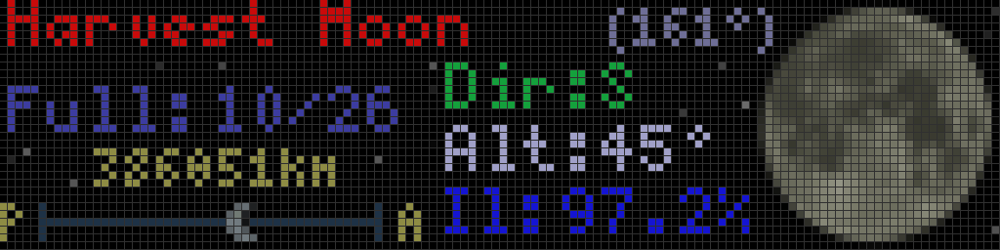

# PlaneSign

[](https://github.com/dmod/PlaneSign/actions/workflows/pipeline.yml)


## Hardware

- Raspberry Pi 4 (2 GB is sufficient)
- 2× 64×32 RGB LED Matrix — 4 mm or 5 mm pitch ([Adafruit](https://www.adafruit.com/product/2277))
- 5 V / 10 A (50 W) power supply (100–240 V AC → DC adapter)
- 15 female-to-female breadboard jumper wires (150 mm recommended)
- 3D-printed components:
  - [L-bracket](.data/adjustable_L_bracket.stl) for panel attachment
  - Rectangle spacer (~4 mm) for panel spacing
- Wood frame:
  - 1″ × 4″ board (minimum 6 ft)
  - Top piece: 25 3/16″
  - Side piece: 6 5/16″ (for 5 mm pitch)
- Fasteners:
  - Socket cap screws (M3-0.5 × 16 mm)
  - #4S flat washers for spacing
- [Wiring instructions](https://github.com/hzeller/rpi-rgb-led-matrix/blob/master/wiring.md)

## Software Setup

### Prepare the SD Card

1. Use [Raspberry Pi Imager](https://www.raspberrypi.com/software/) to flash **Raspberry Pi OS Lite** to the SD card.
   - In the Imager's **OS Customisation** screen you can pre-configure Wi-Fi, enable SSH, and set the hostname to `planesign` — no manual file editing required.
2. After flashing, edit the boot partition:
   - Disable on-board sound — add `dtparam=audio=off` to `/boot/firmware/config.txt`.
   - Isolate a CPU core for the matrix driver — append `isolcpus=3` to the end of `/boot/firmware/cmdline.txt`.
3. Insert the SD card and power on the Pi.

> **Note:** Raspberry Pi OS Bookworm and later use **NetworkManager** instead of `wpa_supplicant` for Wi-Fi. Configure Wi-Fi through Raspberry Pi Imager, `raspi-config`, or `nmcli`:
> ```sh
> sudo nmcli device wifi connect "YourSSID" password "YourPassword"
> ```

### Installation

#### Docker (recommended)

```sh
curl -fsSL https://raw.githubusercontent.com/dmod/PlaneSign/main/docker_install_and_update.sh | sudo bash
```

Run the same command again to update an existing installation. The script downloads the current deployment files from GitHub, preserves `sign.conf` if it already exists, keeps sketches and generated lightning map cache files on the host, pulls the latest PlaneSign image, removes any existing `PlaneSignRuntime` container, and recreates it with Docker Compose.

The updater is intentionally self-contained so older checkouts on the device do not need to know about newer deployment file names.

#### Classic (without Docker)

```sh
cd /home/pi && git clone https://github.com/dmod/PlaneSign && ./PlaneSign/install_and_update.sh
```

## Testing Locally Without a Matrix

Run the sign against an emulated matrix instead of the LED panels:

```sh
uv sync
.venv/bin/python planesign/__main__.py --web
```



- **Web emulator:** with nginx running, watch the matrix at `http://localhost/display.html` and use the controls at `http://localhost/`. The API is at `http://127.0.0.1:5055`, for example `/set_mode/MOON`.
- **Frame capture:** `http://127.0.0.1:5056/frame.png?scale=8` returns the current frame as a PNG, and `/frame.txt` returns it as a character map. Add `?fresh=1` to wait for the next frame.
- **Options** (`--help` lists them all):

| Option | Purpose |
|---|---|
| `--mode MOON` | Show a mode after the welcome screen |
| `--fake-time 2026-12-24T18:00` | Start the clock at a given time; without an offset it's local to the sign |
| `--time-speed 60` | Run the clock faster than real time |
| `--set MILITARY_TIME=true` | Override a setting for this run only; repeatable |
| `--config PATH` | Read and save settings in another file instead of `sign.conf` |
| `--api-port 5065 --ws-port 5066` | Run a second instance alongside the first; preview it at `display.html?ws_port=5066` |

The clock can also be changed while running with `/api/debug/clock?at=2026-12-31T23:59:50&speed=10`, and `?reset=1` restores real time.

`/frame.txt` maps every pixel to a character, with a column ruler, row numbers and a colour legend. This excerpt is the "Full:10/26" line from the frame above:

```text
frame 3534 | mode MOON | clock 2026-09-24 23:33:32 EDT | captured 0.02 s ago | 128x32
             1111111111222222222233333333334444444444555555
   01234567890123456789012345678901234567890123456789012345
11 .BBBB.......BB...BB..........B....B........BB...BB.....:
12 .B...........B....B...BB....BB...B.B....B.B..B.B........
13 .BBB..B..B...B....B...BB.....B...B.B...B.....B.BBB......
14 .B....B..B...B....B..........B...B.B..B.....B..B..B.....
15 .B....B..B...B....B...BB.....B...B.B.B.....B...B..B.....
16 .B.....BBB..BBB..BBB..BB....BBB...B.......BBBB..BB......
legend: . black
  : #25251f average, 139 px
  B #3c3ca0 average, 92 px
```

## Technical Notes

### Audio

- Runtime audio uses `mpg123` for MP3 soundboard clips and horse-race music, and `alsa-utils` (`aplay` and `amixer`) for microphone playback, USB speaker detection, and volume control. FFmpeg is not needed in the runtime image.
- Microphone recording requires HTTPS, microphone permission, and a browser with Web Audio/AudioWorklet support (current Chrome, Firefox, Edge, and Safari). The browser captures 16-bit PCM WAV directly, with mono/stereo support; neither browser recording codecs nor server-side transcoding are needed. ALSA adapts playback to the USB speaker.
- Microphone uploads are limited to **32 MiB** in the browser, API, and both nginx configurations. At 48 kHz this allows about 5.8 minutes of mono or 2.9 minutes of stereo audio. Oversized or invalid recordings report an error instead of playing.
- The microphone nginx route allows up to one hour for the response because the API waits for playback to finish; other routes retain their normal body-size and timeout limits. Classic installations need to deploy the updated nginx configuration and reload nginx.
- With `--web`, soundboard clips and microphone recordings play in the controlling browser; horse-race music remains silent.
- Regenerating the bundled horse-race MP3s with `sounds/horse_race/generate_music.py` still requires FFmpeg on the authoring machine only. The generated tracks are already included; no runtime generation is needed.
- Rebuild/pull the new Docker image to remove the old FFmpeg dependency tree. Updating a classic installation installs the new players but does not automatically remove existing system packages that other applications might use.

### Display and data

- Mandelbrot calculations use NumPy for groups of pixels and scalar Python for the remaining small groups, without Numba or LLVM. Deep zooms and the occasional random search for a new zoom target can be CPU-intensive, especially on a Raspberry Pi.
- Update the static cache: `./update_static_cache.py`
- Text positioning:
  - X, Y coordinates represent the bottom-left corner of characters.
  - (0, 0) is the top-left of the RGB matrix.
- Demo test command:
  ```sh
  sudo rpi-rgb-led-matrix/examples-api-use/demo --led-slowdown-gpio=4 --led-cols=64 --led-chain=2 -D4
  ```
- 5 mm pitch panels: approximately 26¾″ × 8″ overall.

## Credits

### Data Providers

- OpenWeather™
- FlightRadar24
- ucsusa.org
- n2yo.com
- finnhub.io
- coinmarketcap.com
- onthesnow.com
- googleapis.com
- ourairports.com
- [datasets/country-codes](https://github.com/datasets/country-codes) (country names)
- quickmaptools.com (state and county polygons)
- [Natural Earth Vector](https://github.com/nvkelso/natural-earth-vector/tree/master/geojson) (countries and water bodies)
- open-elevation.com

### Sound Resources

- freesoundslibrary.com
- freesound.org
- zapsplat.com
- myinstants.com
- pixabay.com

### Additional Information

**Connect via Serial USB**
https://forums.raspberrypi.com/viewtopic.php?t=307094

**Fix Bluetooth**
raspberrypi/linux#7473.
```sh
sudo rpi-update
```
