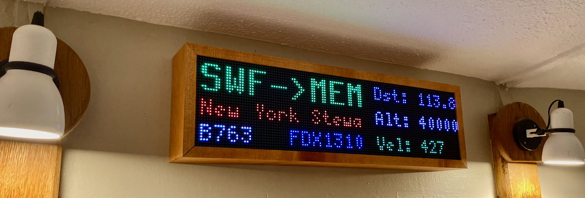

# PlaneSign

[](https://github.com/dmod/PlaneSign/actions/workflows/pipeline.yml)



## Hardware

- Raspberry Pi 4 (2 GB is sufficient)
- 2× 64×32 RGB LED Matrix — 4 mm or 5 mm pitch ([Adafruit](https://www.adafruit.com/product/2277))
- 5 V / 10 A (50 W) power supply (100–240 V AC → DC adapter)
- 15 female-to-female breadboard jumper wires (150 mm recommended)
- 3D-printed components:
  - [L-bracket](.data/adjustable_L_bracket.stl) for panel attachment
  - Rectangle spacer (~4 mm) for panel spacing
- Wood frame:
  - 1″ × 4″ board (minimum 6 ft)
  - Top piece: 25 3/16″
  - Side piece: 6 5/16″ (for 5 mm pitch)
- Fasteners:
  - Socket cap screws (M3-0.5 × 16 mm)
  - #4S flat washers for spacing
- [Wiring instructions](https://github.com/hzeller/rpi-rgb-led-matrix/blob/master/wiring.md)

## Software Setup

### Prepare the SD Card

1. Use [Raspberry Pi Imager](https://www.raspberrypi.com/software/) to flash **Raspberry Pi OS Lite** to the SD card.
   - In the Imager's **OS Customisation** screen you can pre-configure Wi-Fi, enable SSH, and set the hostname to `planesign` — no manual file editing required.
2. After flashing, edit the boot partition:
   - Disable on-board sound — add `dtparam=audio=off` to `/boot/firmware/config.txt`.
   - Isolate a CPU core for the matrix driver — append `isolcpus=3` to the end of `/boot/firmware/cmdline.txt`.
3. Insert the SD card and power on the Pi.

> **Note:** Raspberry Pi OS Bookworm and later use **NetworkManager** instead of `wpa_supplicant` for Wi-Fi. Configure Wi-Fi through Raspberry Pi Imager, `raspi-config`, or `nmcli`:
> ```sh
> sudo nmcli device wifi connect "YourSSID" password "YourPassword"
> ```

### Installation

#### Docker (recommended)

```sh
curl -fsSL https://raw.githubusercontent.com/dmod/PlaneSign/main/docker_install_and_update.sh | sudo bash
```

Run the same command again to update an existing installation. The script downloads the current deployment files from GitHub, preserves `sign.conf` if it already exists, keeps sketches and generated lightning map cache files on the host, pulls the latest PlaneSign image, removes any existing `PlaneSignRuntime` container, and recreates it with Docker Compose.

The updater is intentionally self-contained so older checkouts on the device do not need to know about newer deployment file names.

#### Classic (without Docker)

```sh
cd /home/pi && git clone https://github.com/dmod/PlaneSign && ./PlaneSign/install_and_update.sh
```

## Technical Notes

- Mandelbrot calculations use NumPy for groups of pixels and scalar Python for the remaining small groups, without Numba or LLVM. Deep zooms and the occasional random search for a new zoom target can be CPU-intensive, especially on a Raspberry Pi.
- Update the static cache: `./update_static_cache.py`
- Run without hardware: `.venv/bin/python planesign/__main__.py --web`, then preview at `http://localhost/display.html` or capture the current frame from `http://127.0.0.1:5056/frame.png` (or `/frame.txt` for a character map). `--help` lists the testing flags, including `--mode`, `--fake-time`/`--time-speed` for a fake clock (also settable at `/api/debug/clock`), `--set KEY=VALUE` config overrides, `--config` and alternate ports for a second instance.
- Text positioning:
  - X, Y coordinates represent the bottom-left corner of characters.
  - (0, 0) is the top-left of the RGB matrix.
- Demo test command:
  ```sh
  sudo rpi-rgb-led-matrix/examples-api-use/demo --led-slowdown-gpio=4 --led-cols=64 --led-chain=2 -D4
  ```
- 5 mm pitch panels: approximately 26¾″ × 8″ overall.

## Credits

### Data Providers

- OpenWeather™
- FlightRadar24
- ucsusa.org
- n2yo.com
- finnhub.io
- coinmarketcap.com
- onthesnow.com
- googleapis.com
- ourairports.com
- [datasets/country-codes](https://github.com/datasets/country-codes) (country names)
- quickmaptools.com (state and county polygons)
- [Natural Earth Vector](https://github.com/nvkelso/natural-earth-vector/tree/master/geojson) (countries and water bodies)
- open-elevation.com

### Sound Resources

- freesoundslibrary.com
- freesound.org
- zapsplat.com
- myinstants.com
- pixabay.com

### Additional Information

**Connect via Serial USB**
https://forums.raspberrypi.com/viewtopic.php?t=307094

**Fix Bluetooth**
raspberrypi/linux#7473.
```sh
sudo rpi-update
```
